## Project 2

# Irish Mortgage Consulting

Project is deployed [here]( https://fitabigail.github.io/IrishMortgageConsulting/)   
Github repository is [here](https://github.com/fitabigail) 

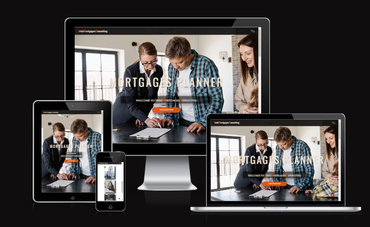

# Introduction
This project is the second one I've undertaken as part of the Full Stack Software Diploma course at [Codeinstitute.net](https://www.CodeInstitute.net).
It is an website about mortgages trough broker. The mortgage broker offer advices  to the user about the requirements in relation to obtain a mortgage and guide him though the mortgage application process. The user is able to build a picture over the future mortgage using a handy calculator to determine how much will be his repayments, the cost of mortgage, and total amount to be pay. Also they have the option to book a meeting trough a Booking Form to meet with one of  the team member to have an in-depth knowledge of the mortgage.
For general questions, and office contact they can rich the Contact Us page where is the office address with email and phone number, and a Contact Form with input fields for name, email and message. 

# User Experience Design

  
  
User Experience/User Interface (UX/UI)

### User stories

#### First Time Visitor Goals

- As a First Time user, I want to easily understand the main purpose of the site.
- As a First Time user, I want to be able to easily navigate throughout the site to find content.
- As a First Time user, I want to view the website and content clearly on my mobile device.
- As a First Time user, I want the website the team is qualified with years of industry experience.
- As a First Time user, I want to find ways to follow the IrishMortgageConsulting on different social media platforms.

### Returning Visitor Goals

- As a Returning user, I want to reused the mortgage calculator for future house upgrades.
- As a Returning user, I want to get update team profiles.
- As a Returning user, I want to contact the organisation so I can request more information.

### Frequent Visitor Goals

- As a Frequent user, I want to check  the mortgage calculator.
- As a Frequent user, I want to check if there are any news about mortgage requirements.
- As a Frequent user, I want to sign up to the Newsletter so that I am emailed any major updates and/or changes to the mortgage requirements.

### Design

  
  
  #### Colour Scheme 

  I tried different colour palettes whilst building the website and settled on a simple combination of shades of orange, grey, white and black.
  Black, and white is used for text color and contrast well with the other two primary colours. Default Orange was used for the link color on hover, and for buttons. Diffrent shades of white, grey, and orange where used for backgrounds.
  - grey : hsla(0, 8%, 5%, 0.9), rgba(0, 0, 0, 0.5); rgba(7, 6, 6, 0.925); rgba(0, 0, 0, 0.87), rgba(0, 0, 0, 0.6);
  - white: antiquewhite, aliceblue ;
  - orange: #ce5713,  #8f2b04;

   #### Typography

  I choose 'Playfair Display' as the font for the site. The headers and forms on all pages throughout the Website are using 'Oswald' font.

   #### Wireframes
  CTRL + Click to open in a new tab.
  
  
 

    

  

 
  
  # Features

  
  
Features

  
  ### Responsive  Website

   The site displays properly at a wide range of screen sizes, further information on this is listed in the testing section. 

   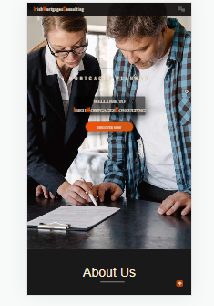        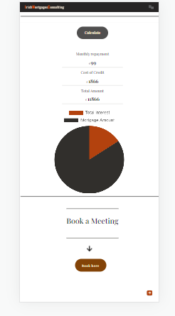           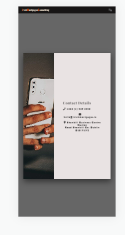;

  ### HOME Page

### Navbar

  - A feature on all three pages, the full responsive navigation bar includes link to Logo, Home page, Calculator page and Contact Us page and is indentical in each page to allow easy navigation. On page loading the navigation bar drop down smoothly to catch up user attention. On left side the navbar has the logo linked to Home page, and a on the right side is the hamburger menu. On mouse click the hamburger is swiching to an arow and a full screen page is loading with the pages links, feature achived with javascript code.

    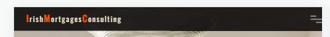

### Section one - the landing

  - This section include several diffrent css annimations on loading page. This include a big  animated banner with two titles bussines related subject, an welcome title, and dicover button  with a shine effect linked with Calculator page.

   

### About section
 
- About section include a video with a custom control, achived with javascript code. On clicking the video button will start the video, and a bar will roll. If press the pause button the video will stop playing.

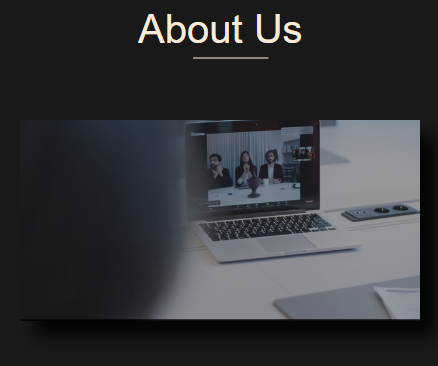

### Team section

- This section  shows profile cards of the three members team. When hover the card  some information about the member will appear with a nice and cool hoover effect, the cards moves smooth with the cursor direction. This effect was achived calling JQuery cdn tools for plugin tilt.js.

### Footer 
- The footer is a simple one which offer information about office address, and include easy access to the main relevant social media sites for Irish Mortgage Consulting.

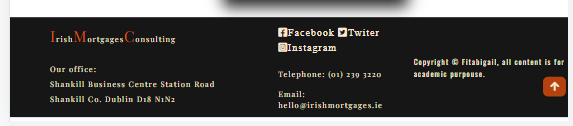
  
  
### Scroll button
- Home and Calculator has a scrool button with a smooth move to top of the pages( used javascript for a smooth move).   
    
 ### CALCULATOR Page

### Calculator section
- Include a mortgage calculator to calculate the monthly repayments, cost of mortgage, and total to pay. Also include a pie chart which diplay amount borrowed and interest to pay. All this features are achived with javascrit code.

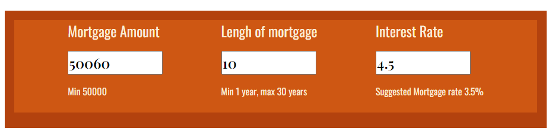
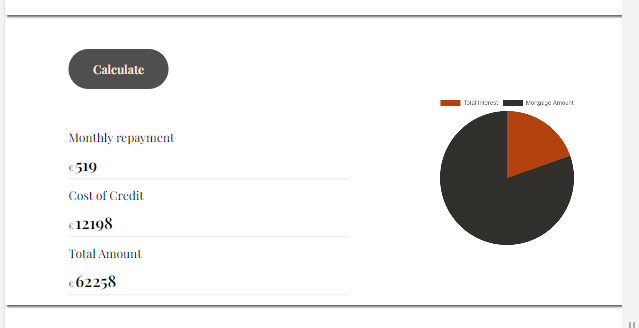

### Booking section
- This section includes two parts. First the banner with an animated arrow created with style css, and a button on click is opening the booking form.
The second part is the Booking Form  with two parts: on the left side has the inputs fields, a check box (style css), an a submit button; on the right an image with a welcome message. On the right bottom corner has a closing button on x shape to exit the form(javascript code used for form). On submition will display an alert message.

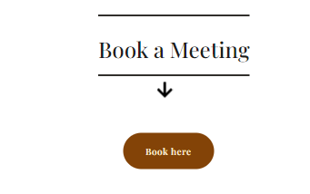
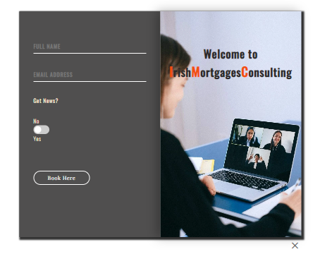

### Contact Us Page

- Contact us page has as a future fliping Contact Form with two sides. On the first side the user can read the office address, and on the other side is the contact form with input fields for name, email, phone, message and a submit buttom. The user on submition will get an alert message. The contact form is calling Smtp.com script plugin. This required an SMTP server, which I could implemented as required a domain to be owned.This is a feature plan to add integration with an email autoresponder service, such as Sendgrid.

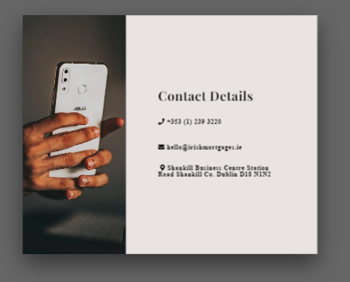
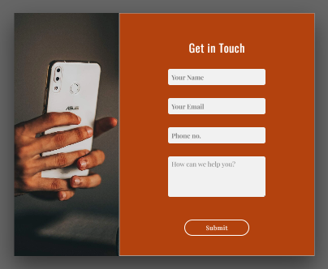
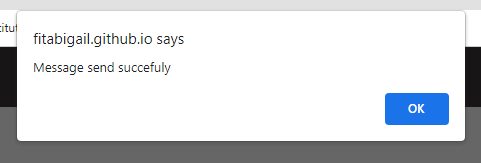

### Possible Future Features

I would like to add extra features to the site such us:

 - to add in the future is integration with an email autoresponder service, such as Sendgrid;
 - two more morgage calculator, one for Mortgage Rate Change Calculator and one for Extra Mortgage Payments Calculator;
 - a blog where to post the lastes new from industry;
 - a Live Chat Service could be implemented to provide instant answers to user specific questions.
 - a register form help the user to create an account and upload required documentation;

 
    

# Technologies Used

  
Technologies Used

  
  #### Languages Used
  
  - HTML5
  - CSS
  - Javascript

  #### Applications Used

- [Balsamiq](https://www.balsamiq.com) was used to create wireframes for this project.
- [Google Fonts](https://fonts.google.com/) fonts were downloaded from Google Fonts.
- [Fontawesome](https://www.fontawesome.com) icons were downloaded from Font Awesome.com.
- [Git](https://git-scm.com/) Git was used for version control.
- [GitHub](https://github.com/) GitHub is used to store the projects code.
- [Gitpages](https://pages.github.com/) Gitpages are used to deploy the site.
- [Chrome Developer Tools](https://developer.chrome.com/docs/devtools/) used for layout and responsive testing.
- [favICO.com](https://convertico.com/favicon/) used for creating favicon.
- [W3 Validator](https://jigsaw.w3.org/css-validator/) used to test html and css code.
- [Jshint](https://jshint.com/) used to validate Javascript code.
- [Freeconvert.com](https://www.freeconvert.com) was used to convert the background image file to the  webp format.
- [Pexels.com](https://www.pexels.com) was used for free images.
- [Caniuse.com/webp](https://caniuse.com/webp)  used to check compatibility of the webp file format.
- [befunky.com](https://www.befunky.com/)  used to resize the images files.
- [Cloudinary](https://cloudinary.com/console) used to host and served the video file through cloudinary.
-[jQuery](https://releases.jquery.com/jquery/) use to implement tilt.js for team profile card moving effect;
-[SmtpJS.com](https://releases.jquery.com/jquery/) used for contact us form;

   

  
  
# Testing 

  
Testing

### W3c CSS Validator
  The css file was tested using the W3c CSS validator showing no errors, and 4 warnings all of the type "is a vendor extension" as shown below..

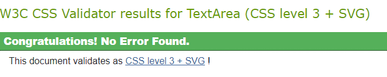

 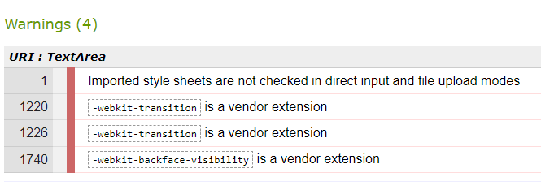

### W3c HTML Validator
  The HTML was tested with the W3c HTML Validator with no error returned all three pages.  

 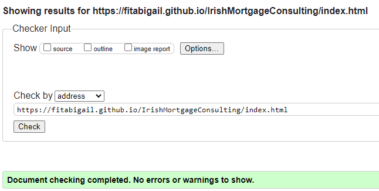

 ### JSHint
  The Javascript file was validated using JSHint, with the following result. The `New JavaScript features (ES6)` option was ticked in the 
  Configure menu. 

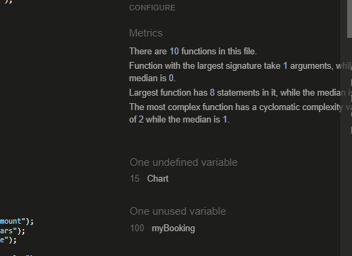

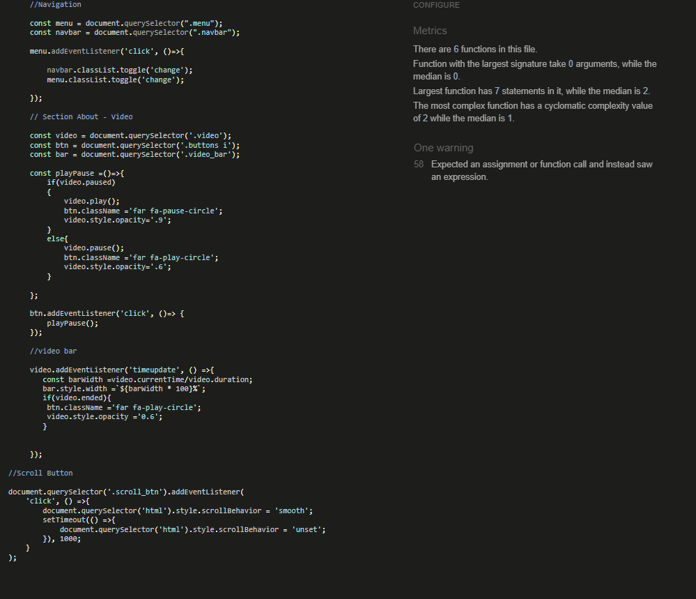
  

   ### Lighthouse
  The web page was tested using the Lighthouse feature on the chrome browser giving the following result for desktop and mobile.    
  It should be noted that the performance score was variable, ranging from the low eighties to 100 for desktop and mobile.  

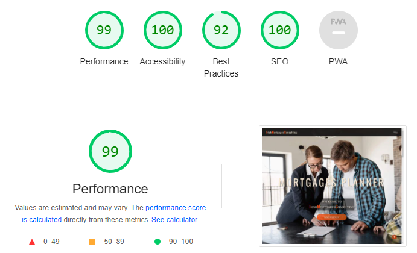
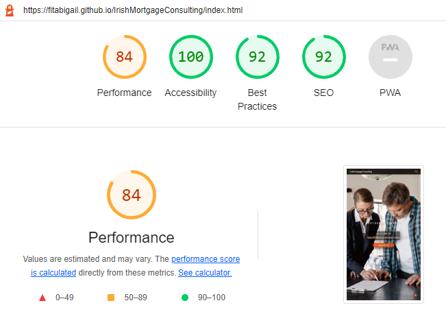
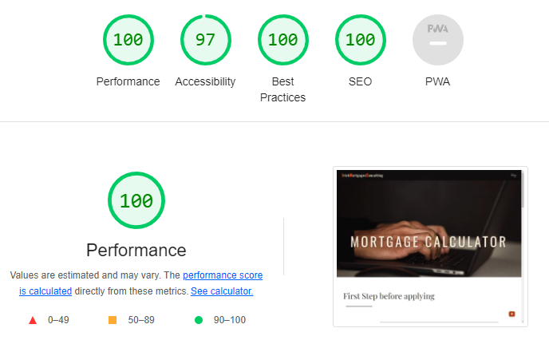
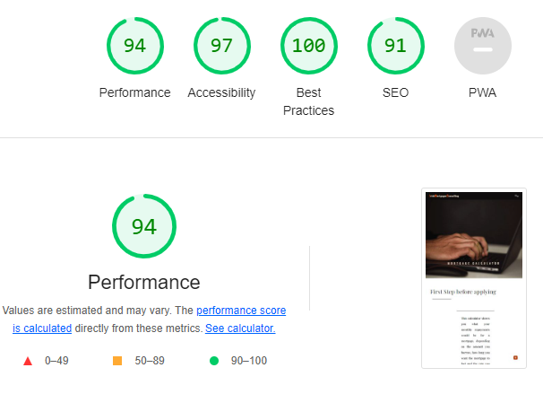
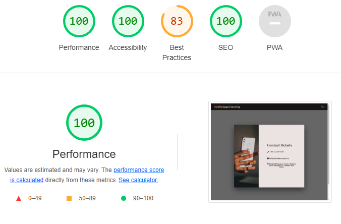
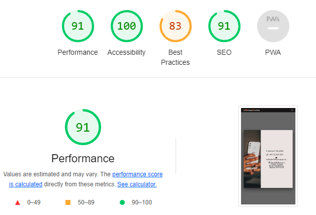

### Responsiveness
  Media queries based on screen width were used to ensure the page displayed correctly across a range of screen sizes.
  The Chrome, Firefox, Safari and Edge browsers were used to test responsiveness.  
  
  Breakpoints used are as follows 320px, 360px, 400px, 450px, 500px, 550px,  600px, 650px, 700px, 750px, 800px, 850px, 880px, 900px, 950px, 980px, 1200px and 1600px. 

 I also used the device specific tool within Chrome and Edge to test a number of devices representing a wide range of device types.  
  The results are given below.

  |Device                 |  Result        |
  |----------------       |----------------|
  | Galaxy S8+            | Displays ok    | 
  | iPad mini             | Displays ok    |
  | iPad Air              | Displays ok    | 
  | iPhone xe/xr/pro 12   | Displays ok    | 
  | Galaxy Fold           | Displays ok    | 
  | Galaxy Fold           | Displays ok    | 
  | Nest Hub Max          | Displays ok    | 
  
    
 ### Issues Encountered Building The Site

A brief summary of some of the difficulties I had building this site and how I attempted to fix them.  

 + I had many problems positioning the text div from Calculator page and fixed using diffrent percents for 'font-size', widh and height set on vh to get them to satisfactorily position on diffrent devices.
 + The chart pie cause me trouble on diffrent devices size, as had a predefined style. I changed the width and height of canvas html element and adapted to diffrent screen size.
 + The checked box from Booking for put me in difficulty as I tried to set the konb and was not fit on the right spot. So I decide to get already writen code and adapted to my site style, which worked well only the html validator did not allow div as a child of a label so I replaced and fixed the error with a span element.
 + On booking form submit button on click apper a message to user and shoud return to the Calculator page. I write the function myBooking() to write the alert message and retun to page. The function was not working as I used form action attribute from w3 web page for testing example. Now I know no need of action attibute, if I have a function to call.
+ I had to become familiar with many new (to me) css properties such as transform-origin, transform-style, backface-visibility and perspective. 

### Manual Testing for Bugs

Testing is required on Irish MortgageConsulting Responsive Website.

The project is developed primarily using HTML and CSS, with a small amount of JavaScript implemented for additional functionality.
The testing performed will be on back-end and front-end. Testing to be done on at least three web browsers and all screen sizes.
All navigation links should direct to the correct html pages as per their names. The Home page is the exception, this one will redirect to index.html. 

All links to external websites must open in a new browser.

Testing of form validation will also be required to ensure the correct inputs are taken and that all fields are required. 

The live Project can be found [here](https://fitabigail.github.io/IrishMortgageConsulting/). 

 * Testing During development of the pages was done through the project to see how the project looked and felt

| Feature                |  Expect                                     |  Action         |  Result                                  |
|------------------------|---------------------------------------------|-----------------|------------------------------------------|
| Logo                   |  Link to home page                          | Click On        | Load the home page                       |
| Banner home animation  |  Animation                                  | On Load         | Animation                                |
| Dicover button         |  Link to calculator page                    | Click On        | Load the calculator page                 |
| Hamburger Menu         |  Open on full page                          | Click On        | Load menu page                           |
| Hamburger Menu Arrow   |  Transform                                  | Click On        | Arrow                                    |
| Social Media Icons     |  Link to socialmedia                        | Click On        | New tab opened                           |
| Video                  |  Play on                                    | Click on        | Play the video                           |
| Profile cards          |  Show text and move                         | On hover        | Show text and move                       |
| Calculator             |  Calculate the mortgage payments            | On input values | Show the results                         |
| Calculator button      |  Show results                               | Click On        | Show the results                         |
| Pie CHART              |  Post interest to pay and mortgage amount   | On Load         | Post interest to pay and mortgage amount |
| Booking button         |  Open booking form                          | Click On        | Open booking form                        |
| Booking fields         |  Accept the inputs value                    | On input        | Accept the inputs value                  |
| Booking checkbox       |  To check                                   | On check        | To check                                 |
| Booking form button    |  Show message                               | Click On        | Show the message                         |
| Contact form flip      | Flipp on pointer                            | On pointer      | Flipp on pointer                         |
| Contact form fields    | Accept the inputs value                     | Click On        | Accept the inputs value                  |
| Contact form button    |  Show message                               | Click On        | Show message                             |

### Issues and Resolutions to issues found during testing

- booking form after clossing message alert was not redirected to calculator page, issue fixed;
- the contact form did not send the email with the message, the plugin used https://smtpjs.com/ required SMTP server and I couldn't used my elastic email host account https://elasticemail.com/ because the domain must be verified. Us the gitpod domain name is not owned it can not be verified; 

### Issues Remaining (Known to me)

+ There are large space over the Home and Calculator page. This issue could be fixed by resize the divs, but beacause a short time I will leave this for another time.
+ The bottom height of calculator background increasing once the  device size is decreasing;
+ I shoud increase the color contrast and font size;
+ The pie chart should reset with the new amount and interest pie  when input values to mortgage amount field. At this stage the pie chart is updating on change of the years and interest values;

### GitHub Pages

# Deployment

  

    
  
Deployment

  
  This project was built on the Gitpod IDE using the Code Institute template found here: https://github.com/Code-Institute-Org/gitpod-full-template
      
      
### GitHub Pages

## How this Project was Deployed

1. Log into [GitHub](https://github.com/fitabigail/).
2. From the list of Repositories, select [IRISH MORTGAGE CONSULTING](https://github.com/fitabigail/IrishMortgageConsulting).
3. From the Repositories sub-headings, select "Settings".
4. Under "Options", the first category of settings, scroll down to the GitHub Pages section.
5. From the dropdown list under the "Source" heading, select "main".
6. A second drop-down menu that appears should remain as the default value, "/root".
7. Press Save. 
8. On Page refresh, scroll back down to the GitHub Pages section, and the link to the deployed site will be available in a green sub-section with a tick icon next to it.

As this project was developed on the main branch, all changes made to the repository are immediately reflected in the deployed project.

## How to Run this Project in your Browser

1. Install the [Google Chrome](https://www.google.co.uk/chrome/) or [Firefox](https://www.mozilla.org/en-GB/exp/firefox/new/) browser.
2. Install the applicable [GitPod](https://www.gitpod.io/docs/browser-extension/) Browser Extensions for your chosen browser.
4. Create a [GitHub](https://GitHub.com/join) account. 
3. Log in to [Gitpod](https://gitpod.io/login/) using your GitHub account.
4. Visit Hard Driver's [GitHub Repository](https://github.com/fitabigail/IrishMortgageConsulting).
5. Open the repository in Gitpod:
    * Click the green "Gitpod" icon at the top of the Repository, or
    * Click this [link](https://github.com/fitabigail/IrishMortgageConsulting).
6. A new workspace will open with the current state of the main branch. Any changes made to the main branch after this point will not be automatically updated in your Gitpod Workspace.

#### Forking
  
  
  1. Go to the Github page that hosts the repository you wish to fork.
  2. On the top-right of the page there is a button "Fork".
  3. Click this button.
  4. This creates a repository in your Github home page which is a copy of the original. You can submit and receive changes to the code by using pull requests 
  and/or syncing with the upstream repository.

### Cloning the Repository

1. Visit Hard Driver's [GitHub Repository](https://github.com/fitabigail/IrishMortgageConsulting).
2. Click the "Code" dropdown box above the repository's file explorer. 
3. Under the "Clone" heading, click the "HTTPS" sub-heading.
4. Click the clipboard icon, or manually copy the text presented: `https://github.com/fitabigail/IrishMortgageConsulting`
5. Open your preferred IDE (VSCode, Atom, PyCharm, etc).
6. Ensure your IDE has support for Git, or has the relevant Git extension.
7. Open the terminal, and create a directory where you would like the Repository to be stored.
8. Type `git clone` and paste the previously copied text (`https://github.com/fitabigail/IrishMortgageConsulting`) and press enter.
9. The Repository will then be cloned to your selected directory. 

### Manually Downloading the Repository

1. Visit Hard Driver's [GitHub Repository](https://github.com/fitabigail/IrishMortgageConsulting).
2. Click the "Code" dropdown box above the repository's file explorer. 
3. Click the "Download ZIP" option; this will download a copy of the selected branch's repository as a zip file.
4. Locate the ZIP file downloaded to your computer, and extract the ZIP to a designated folder which you would like the repository to be stored.

### Opening the Repository 

1. Open your preferred IDE (VSCode, Atom, PyCharm, etc).
2. Navigate to the chosen directory where the Repository was Cloned/Extracted.
3. You will now have offline access to the contents of the project.

 

 # Credits
  

  
Credits

 
  ### Images

  ### All Photographs were sourced from [Pexels](https://www.pexels.com//). 

  - Section one Background Image: https://images.pexels.com/photos/7415057/pexels-photo-7415057.jpeg?cs=srgb&dl=pexels-mart-production-7415057.jpg&fm=jpg;
  - Team member one Image: https://images.pexels.com/photos/1311523/pexels-photo-1311523.jpeg?cs=srgb&dl=pexels-mentatdgt-1311523.jpg&fm=jpg;
  -  Team member Two Image:https://images.pexels.com/photos/8074612/pexels-photo-8074612.jpeg?cs=srgb&dl=pexels-anastasia-shuraeva-8074612.jpg&fm=jpg;
  -  Team member Three Image:https://images.pexels.com/photos/1043471/pexels-photo-1043471.jpeg?cs=srgb&dl=pexels-chloe-1043471.jpg&fm=jpg;
  - Calculator banner Image: https://images.pexels.com/photos/5926378/pexels-photo-5926378.jpeg?cs=srgb&dl=pexels-sora-shimazaki-5926378.jpg&fm=jpg;
  - About us video: https://www.pexels.com/video/professionals-having-an-online-meeting-8189002/;
  - Booking form Image: https://images.pexels.com/photos/4226122/pexels-photo-4226122.jpeg?cs=srgb&dl=pexels-anna-shvets-4226122.jpg&fm=jpg;
  - Contact Us Image: https://images.pexels.com/photos/3856047/pexels-photo-3856047.jpeg?cs=srgb&dl=pexels-matheus-bertelli-3856047.jpg&fm=jpg;

### Code/Reference 

- Code Institute without I would have had no base to begin a project & Readme.md Template .https://codeinstitute.net/ie/
- GitHub for my workspace and saving all my work as well as my deployed project . https://github.com/ ;  
- The Slack community - for someone always been there no matter the time and with advice or direction. https://slack.com';
- https://smartmortgages.ie/ - inspired me for building the site and get the content from them;
 - https://stackoverflow.com/users/6887992/aperezfals - the method of redirect to calculator page after message is closed;
 - https://www.udemy.com/course/10-mega-responsive-websites-with-html-css-and-javascript/learn/lecture/23410300#overview - Udemy course for home page, helping me to build a nice layout;
 - https://www.udemy.com/course/50-web-projects-with-html-css-and-javascript/learn/lecture/32013882#overview -Udemy course for booking form;
 - https://www.youtube.com/watch?v=kIvft1uEi4Y&t=0s - Live Blogger youtube channel help me to create to calculator;
 -  https://dev.to/bosspetta/mortgage-loan-calculator-with-javascript-2la7 - Dev Community help me to understand how declares the values;
 - https://www.youtube.com/watch?v=sGQSz22U8VM - Easy youtube chanel tutorials for contact us form;
 - https://www.w3schools.com/ - guide me for flipping contact form;

### Note 
 - I'd like to thank my mentor Ronan McClelland for his guidance throughout my project. 
 - I would like to thank everyone for all and any assistance given during the development of my website. 
 - All information within this website is for education and training purposes only .
 - All code has been as much as possible credited to the source that the code came from.
